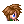
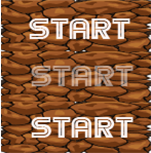
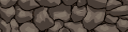
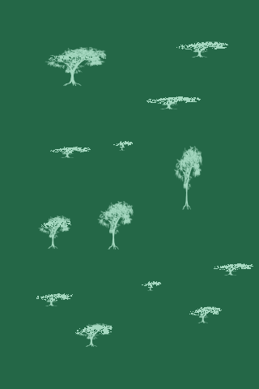
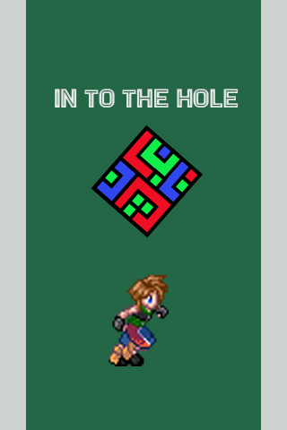

# In-to-the-Hall
A project purposes
# Sample video
https://drive.google.com/drive/folders/1UHhbQehZoq16_ESRiV9GhTuLl-zwfRSi
# Project Discription
It’s a type of puzzle game where the player moves in complex passages to find the door to escape the glade.
# Characters
Gladers is the main character in this game. They lost their memories, and that’s the reason why they enter the maze to know why they are in the glade.

# Story
  The glade is huge and broad that ever since no one can escape. There are a lot of gladers put and stock in there and nobody knows where they came from and lost their memories. But one day, a glader arrived, and like the other gladers he has no memory of his previous life. That glader actually becomes one of their group and soon after demonstrates a unique perspective that scores him a promotion to Runner status. He runs in the maze to find a clue to escape together with the other gladers.
# Theme and Game Play
   It is a puzzle game where the gladers need to know the way out. 
    Goals: Need to enter the portal in order to proceed in the next level.
    Users Skills: Tap on the screen/ keys (up, down, left, right), problem-solving skills (to guess where the path is).
    Items and power-ups: None
    Progression and Challenge: Difficulty will advance by having a complexity in the maze.
    Losing: There are no losing conditions however, time is being measure everytime you play the game(timer).
 # Art style
  This is a 2D flat design game that uses simple elements like shape, texture, and bright colors. Our character is cutesy and small with a big head.
 # Music and Sound
  It sounds everytime the character touches the wall.
 #Technical description
  The game will be Mobile Cross-platform: iOS, Android, Windows Phone, Web browser, PC.
 #Controls
  iOS, Android, and Windows Phone: Touch Gesture (basic dragging to move). Web browser and PC: keyboard and mouse controls.
 # Audio and sounds
    Bounce Sound
 # Graphics
 
 
 
 
 
 
 
 
 
 
 
 
 
 
 
 
 
 
 
 
 
 
 
 
 
 
# Demographics
	Age: 5 years old and up
	Sex: Everyone
#
Platforms
	This game can be accessed in a PC web browser and can be downloaded in android (play store), and iOs (App store)  for free.

  

   

